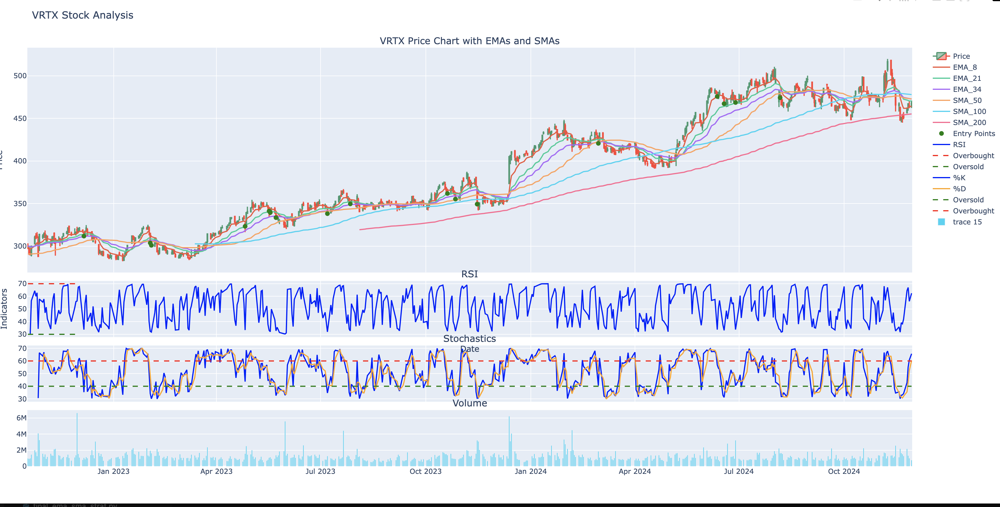
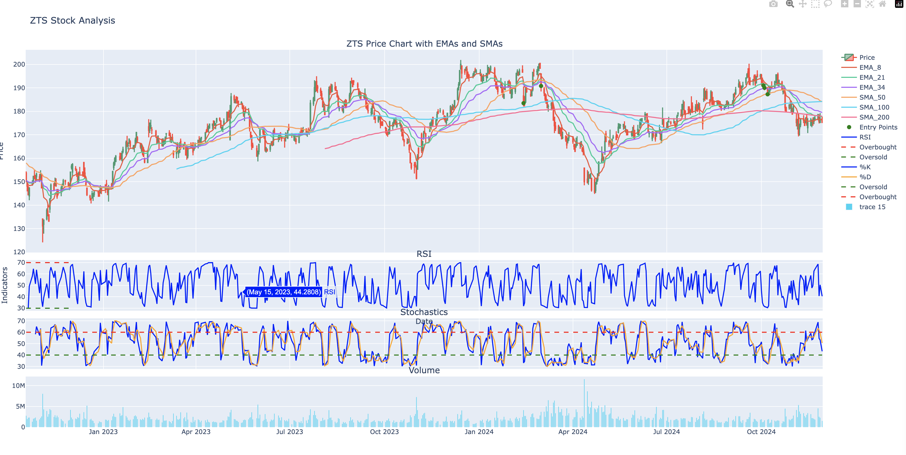

# Stock Trading Strategy Script: Bullish entry

This Python script is designed to automate the identification of high-probability buying opportunities in the stock market. It leverages technical indicators such as Exponential Moving Averages (EMA), Simple Moving Averages (SMA), Relative Strength Index (RSI), and Stochastics to detect upward trends. By analyzing market inefficiencies—imbalances between buyers and sellers—the script pinpoints potential entry points for trades. This approach is part of a broader trend-following strategy aimed at streamlining what is traditionally a discretionary trading process. In the long term, this script aims to provide a trader with a systematic trading strategy based on an automated evaluation of current stocks and indices. Because of my background in Economics and Finance, I am passionate about combining my interests in these fields with my coding skills to learn as a programmer and investor. 

## Table of Contents

1. [Dependencies](#dependencies)
2. [File Structure](#file-structure)
3. [Function Overview](#function-overview)
   - [get_stock_data_csv](#get_stock_data_csv)
   - [calculate_ema](#calculate_ema)
   - [calculate_sma](#calculate_sma)
   - [calculate_rsi](#calculate_rsi)
   - [calculate_stochastics](#calculate_stochastics)
   - [bullish_strategy](#bullish_strategy)
   - [evaluate_strategy](#evaluate_strategy)
4. [Execution](#execution)
5. [Outputs](#outputs)

---

## Dependencies

list of following dependancies:

- `pandas`: For data manipulation and analysis.
- `numpy`: For numerical operations.
- `os`: For handling file paths.
- `plotly`: For creating visualizations (though not actively used in the provided script).

Install these dependencies via pip if not already installed:

pip install pandas numpy plotly

## File Structure

- `csv/`: Directory containing CSV files with stock data. Each file is named after the stock ticker (e.g., `CAT.csv`).
- `script.py`: The Python script containing the trading strategy logic.

---

## Function Overview

### 1. `get_stock_data_csv`

**Purpose**: Loads stock data from CSV files located in the `csv/` directory.

- **Parameters**: `tickers` (list of stock tickers)
- **Returns**: Dictionary of dataframes, keyed by ticker.
- **Details**:
  - Reads CSV files for the specified tickers.
  - Sets the `Date` column as the index and parses it as datetime.
  - Handles missing files gracefully, logging errors.

---

### 2. `calculate_ema`

**Purpose**: Computes Exponential Moving Averages (EMA) for specified periods.

- **Parameters**:
  - `data` (DataFrame): Stock data.
  - `ema_periods` (list): List of periods for EMA calculation.
- **Returns**: Updated DataFrame with EMA columns.

---

### 3. `calculate_sma`

**Purpose**: Computes Simple Moving Averages (SMA) for specified periods.

- **Parameters**:
  - `data` (DataFrame): Stock data.
  - `sma_periods` (list): List of periods for SMA calculation.
- **Returns**: Updated DataFrame with SMA columns.

---

### 4. `calculate_rsi`

**Purpose**: Calculates the Relative Strength Index (RSI).

- **Parameters**:
  - `data` (DataFrame): Stock data.
  - `rsi_period` (int): Period for RSI calculation (default: 2).
- **Returns**: Series of RSI values.

---

### 5. `calculate_stochastics`

**Purpose**: Computes Stochastic Oscillators.

- **Parameters**:
  - `data` (DataFrame): Stock data.
  - `k_period` (int): Period for %K calculation (default: 8).
  - `d_period` (int): Period for %D calculation (default: 3).
- **Returns**: DataFrame with `%K` and `%D` columns.

---

### 6. `bullish_strategy`

**Purpose**: Implements a bullish trading strategy.

- **Parameters**: `data` (dictionary of DataFrames)
- **Returns**: Updated dictionary with entry points identified.
- **Details**:
  - Combines multiple indicators (EMA, SMA, RSI, Stochastics).
  - Flags rows meeting specific bullish conditions as entry points.

---

### 7. `evaluate_strategy`

**Purpose**: Evaluates the strategy by calculating potential profit and loss (PNL).

- **Parameters**: `data` (dictionary of DataFrames)
- **Returns**: List of DataFrames with entry points and PNL details.
- **Details**:
  - Identifies entry points based on the strategy.
  - Calculates PNL for each entry point using a target profit of 50% or a minimum holding period of 14 days.

---

**Examples of Output charts**

- ## Examples of Output charts

## LLY


## VRTX



## ZTS



## Execution

To run the script:

1. Place the CSV files for the desired tickers in the `csv/` directory.
2. Execute the script with the desired tickers in the `get_stock_data_csv` function call.

```python
data = get_stock_data_csv(['CAT'])
data = bullish_strategy(data)
entry_points = evaluate_strategy(data)
```

---

## Outputs

- The script generates a CSV file (e.g., `CAT_results.csv`) containing:
  - `Date`: Entry date.
  - `Entry Point`: Indicator of a valid entry point.
  - `Adj Close`: Adjusted closing price at entry.
  - `PNL`: Profit and loss for the trade.
  - `End date`: Date when the trade was exited.

---

## Notes

- This script is designed for educational purposes. Modify the parameters (e.g., EMA, SMA periods, PNL targets) to suit specific trading strategies.
- Ensure that the CSV files have columns: `Date`, `Open`, `High`, `Low`, `Close`, and `Adj Close`.
- Futre results are not indicative of past performance.

```

```
